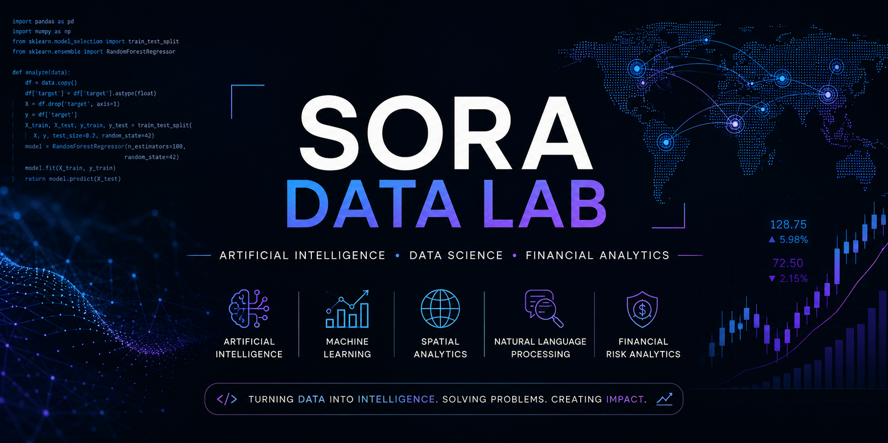

  

# Hi there 👋 I'm Sora Pak

## 🤖 Artificial Intelligence • Data Science • Financial Risk

I'm passionate about transforming complex data into intelligent solutions through Artificial Intelligence, Machine Learning and Data Science.

Currently, I work in Financial Risk and Regulatory Capital while pursuing an MBA in Artificial Intelligence & Analytics.

---

## 🚀 Featured Areas

- 🤖 Artificial Intelligence
- 🧠 Machine Learning
- 🗺️ Spatial Analytics
- 💬 Natural Language Processing (NLP)
- 💹 Financial Risk Analytics
- 📊 Time Series Forecasting

---

## 💻 Tech Stack

🐍 Python • SQL • SAS

📊 Pandas • NumPy • Scikit-Learn

🗺️ GeoPandas • GeoDA • PySAL

🤗 Hugging Face • Transformers

📈 Power BI • Git • GitHub

---

## 🌱 Currently Building

🚧 Spatial Energy Analysis

🚧 NLP Projects

🚧 Machine Learning Portfolio

🚧 AI for Financial Risk

---

## 🎯 2026 Goals

- Build 15+ AI & Data Science projects
- Share technical content on LinkedIn
- Contribute to open-source projects
- Apply AI to Financial Risk problems- Sentiment Analysis using Transformers
- Financial Risk Analytics

---

## 📫 Connect with me

- LinkedIn: https://www.linkedin.com/in/sora-pak-61bbba124/
